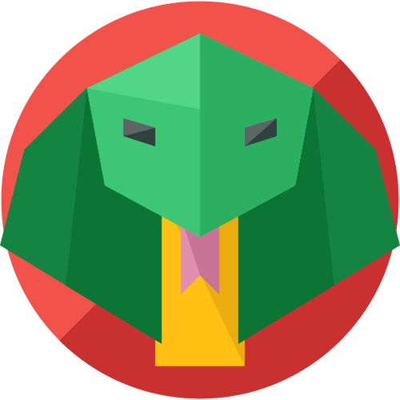

# Welcome to the Cobra's Lair!
We are Three Students from from [Data Science 420: Machine Learning Techniques](https://www.pce.uw.edu/courses/data-science-machine-learning-techniques), part of the three-class [Certificate in Data Science](https://www.pce.uw.edu/certificates/data-science) offered by the [University of Washington](http://www.washington.edu/) [Professional & Continuing Education](https://www.pce.uw.edu/) department.
Python code for our [KDD Cup 2018](https://biendata.com/competition/kdd_2018/) (Cup of Fresh Air) compeititon

## We are:
- Leo Salemann - GitHubber, Agilist, Pythonista, Viz-Kid
- Yash

We roll legit, citing our sources.

Icons made by <a href="https://www.flaticon.com/authors/roundicons" title="Roundicons">Roundicons</a> from <a href="https://www.flaticon.com/" title="Flaticon">www.flaticon.com</a> is licensed by <a href="http://creativecommons.org/licenses/by/3.0/" title="Creative Commons BY 3.0" target="_blank">CC 3.0 BY</a>

